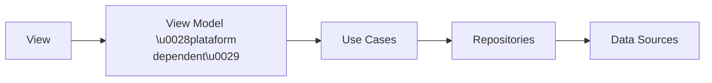
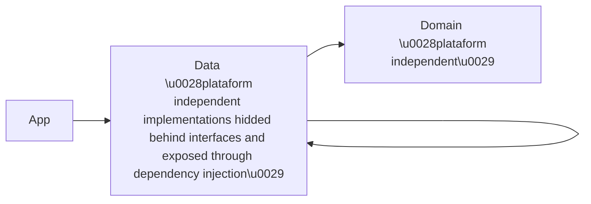

1. Get an account at [marvel](https://developer.marvel.com/)
2. Put your Api key and Private Key in [gradle.properties](./gradle.properties)
3. Run it

# Architecture

```mermaid
graph LR
    A[View] --> B[View Model <br/> \u0028plataform dependent\u0029] --> C[Use Cases] --> D[Repositories] --> E[Data Sources]

```

# Modules

```mermaid
graph LR
    A[App] --> B[MVVM <br/> \u0028plataform independent\u0029] --> B[Data <br/> \u0028plataform independent implementations hidded behind interfaces and exposed through dependency injection\u0029] --> C[Domain <br/> \u0028plataform independent\u0029]

```
